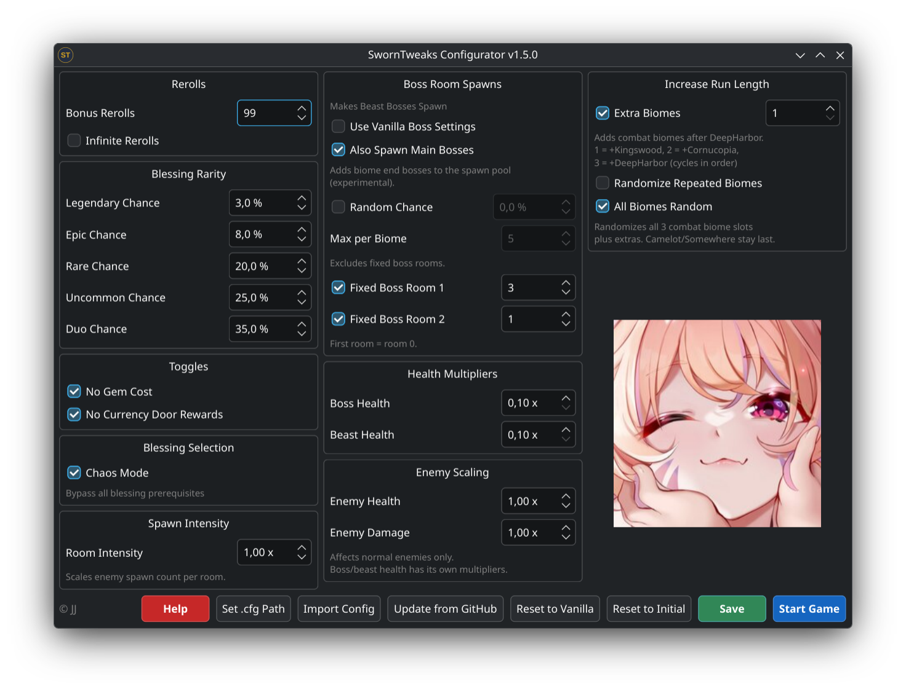

# SwornTweaks

All-in-one SWORN mod combining rerolls, blessing rarity, gem cost skip, door reward replacement, duo boost, biome repeat, random beast rooms, boss/beast health multipliers, and intensity scaling. Everything is configurable.

## Installation

See [INSTALL.md](INSTALL.md) for detailed setup instructions (Windows + Linux).

Quick start:
1. Copy `SwornTweaks.dll` to `SWORN/Mods/`
2. Launch the game — config file is created automatically

## Configurator GUI

A visual config editor with auto-update from GitHub:

```bash
python3 configurator.py
```



See [INSTALL.md](INSTALL.md) for setup. Windows standalone `.exe` available in [Releases](https://github.com/jj-repository/SwornTweaks/releases).

## Configuration

Settings are stored in `SWORN/UserData/MelonPreferences.cfg` under the `[SwornTweaks]` section. Changes take effect on the next run start.

### Rerolls

| Setting | Default | Description |
|---------|---------|-------------|
| `BonusRerolls` | `50` | Extra rerolls added at the start of each run |
| `InfiniteRerolls` | `false` | Set rerolls to 500 on every scene load |

### Blessing Rarity

| Setting | Default | Description |
|---------|---------|-------------|
| `LegendaryChance` | `0.03` | Base chance for legendary blessings (3%) |
| `EpicChance` | `0.08` | Base chance for epic blessings (8%) |
| `RareChance` | `0.20` | Base chance for rare blessings (20%) |
| `UncommonChance` | `0.25` | Base chance for uncommon blessings (25%) |

### Gem Cost

| Setting | Default | Description |
|---------|---------|-------------|
| `NoGemCost` | `true` | Skip the 300 gold gem socket cost |

### Door Rewards

| Setting | Default | Description |
|---------|---------|-------------|
| `NoCurrencyDoorRewards` | `true` | Replace currency rewards (FairyEmber, Silk, Moonstone) with Paragon/ParagonLevelUp |

### Duo Blessings

| Setting | Default | Description |
|---------|---------|-------------|
| `DuoChance` | `0.35` | Duo blessing chance (0.35 = 35%) |

### Increase Run Length

| Setting | Default | Description |
|---------|---------|-------------|
| `ExtraBiomes` | `1` | Number of extra combat biomes (0-3, inserted after DeepHarbor) |
| `RandomizeRepeats` | `false` | Randomize which biomes fill the extra slots |
| `AllBiomesRandom` | `false` | Completely randomize all combat biome order |

Extra biomes are inserted after the original 3 combat biomes (Kingswood, Cornucopia, DeepHarbor) and before Camelot/Somewhere. By default they cycle in order:

- **+1**: ... → DeepHarbor → **Kingswood** → Camelot → Somewhere
- **+2**: ... → DeepHarbor → **Kingswood** → **Cornucopia** → Camelot → Somewhere
- **+3**: ... → DeepHarbor → **Kingswood** → **Cornucopia** → **DeepHarbor** → Camelot → Somewhere

With `RandomizeRepeats`, each extra slot is randomly picked from the 3 combat biomes. With `AllBiomesRandom`, all combat biome slots (original + extras) are fully randomized — DeepHarbor could be first, Kingswood could appear twice, etc. Camelot and Somewhere always remain at the end.

### Beast Boss Room Spawns

| Setting | Default | Description |
|---------|---------|-------------|
| `UseVanillaBeastSettings` | `true` | Use vanilla beast spawning (ignores all settings below) |
| `BeastChancePercent` | `0` | % chance per room for a Legendary Beast fight (0 = disabled) |
| `MaxBeastsPerBiome` | `5` | Max random beast encounters per biome (fixed rooms don't count) |
| `BeastRoom1` | `-1` | Fixed beast boss at this room index (-1 = off, max 12) |
| `BeastRoom2` | `-1` | Fixed beast boss at this room index (-1 = off, max 12) |

Room indices are 0-based within each biome. Room counts: Kingswood=15 (0-14), Cornucopia=13 (0-12), DeepHarbor=13 (0-12). Fixed rooms always trigger; random chance only replaces normal combat rooms and respects the per-biome cap.

### Player

| Setting | Default | Description |
|---------|---------|-------------|
| `PlayerHealthMultiplier` | `1.0` | Health multiplier for the player character (1.0 = no change) |

### Health Multipliers

| Setting | Default | Description |
|---------|---------|-------------|
| `BossHealthMultiplier` | `2.0` | Health multiplier for bosses like Gawain, Arthur (1.0 = no change) |
| `BeastHealthMultiplier` | `2.0` | Health multiplier for legendary beasts like Dagonet (1.0 = no change) |

### Enemy Scaling

| Setting | Default | Description |
|---------|---------|-------------|
| `EnemyHealthMultiplier` | `1.0` | Health multiplier for normal enemies (1.0 = no change) |
| `EnemyDamageMultiplier` | `1.0` | Damage multiplier for normal enemies (1.0 = no change) |

Affects regular enemies only — bosses and legendary beasts use their own multipliers above.

### Intensity

| Setting | Default | Description |
|---------|---------|-------------|
| `IntensityMultiplier` | `1.0` | Global room intensity multiplier (higher = harder spawns) |

Multiplies the result of `BiomeData.GetRoomIntensity`. Affects enemy spawn density/difficulty across all biomes.

### Blessing Selection

| Setting | Default | Description |
|---------|---------|-------------|
| `ChaosMode` | `false` | Bypass all blessing prerequisites — any blessing can appear at any banner |

When enabled, every blessing is treated as valid regardless of its prerequisite requirements. This means you can get any blessing from the god you selected without needing dependent blessings first.

## Example Config

```ini
[SwornTweaks]
BonusRerolls = 50
InfiniteRerolls = false
LegendaryChance = 0.03
EpicChance = 0.08
RareChance = 0.2
UncommonChance = 0.25
NoGemCost = true
NoCurrencyDoorRewards = true
DuoChance = 0.35
ExtraBiomes = 0
RandomizeRepeats = false
AllBiomesRandom = false
UseVanillaBeastSettings = true
BeastChancePercent = 0
MaxBeastsPerBiome = 5
BeastRoom1 = -1
BeastRoom2 = -1
PlayerHealthMultiplier = 1
BossHealthMultiplier = 2
BeastHealthMultiplier = 2
EnemyHealthMultiplier = 1
EnemyDamageMultiplier = 1
IntensityMultiplier = 1
ChaosMode = false
```

## Supersedes

This mod replaces the following individual mods:
- SwornRerollMod
- SwornRarityMod
- SwornNoGemCost
- SwornNoCurrencyDoorRewards
- SwornDuoBoost
- SwornMoreRooms
- SwornBossHealthBoost
